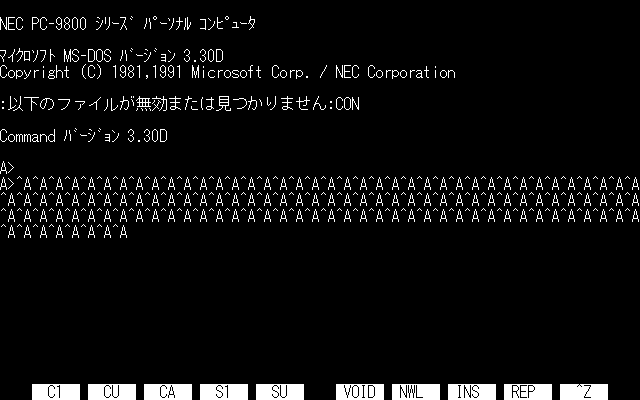
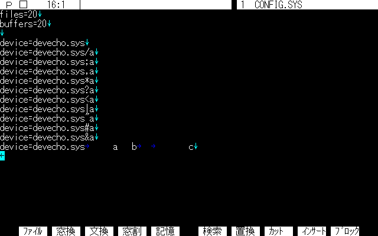
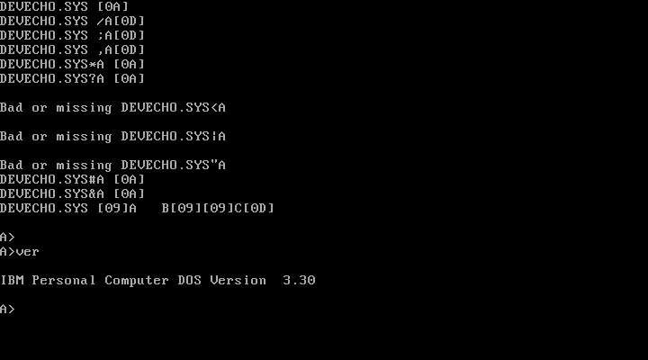

# いまさら人が聞かないDOSデバイスドライバ開発の小技

「人に訊けない」というものでもないな…本当にいまさらだし…（これ書いてるの西暦2023年なので…）

なお、ここに挙げたサンプルソースは、特に断りがない限り無保証かつPublic Domainとなっております。随意にご利用ください。

## 1. INIT（初期化）

### 1.1 文字型デバイスを常駐させずに終了する（DOS 2.x～4.0）

少なくともIBM DOS 5.0のプログラマーズリファレンスマニュアルには、デバイスドライバの非常駐終了の正式な手順が公開されていた。
リクエストヘッダのユニット数を0に、終了アドレスをデバイスヘッダの先頭（一般的なドライバではCS:0000）に設定することで正常終了する。
（ちなみにNECのMS-DOS 5.0プログラマーズリファレンスマニュアルには記述がない）

DOS2～4で正しい手順が公開されることはなかった。
DOS 5で公開された方法で正常に非常駐終了できるのはブロックデバイスだけで、文字型デバイスを同じ手順で終了するとMS-DOSはハングアップする。

 

多少荒業になるが、終了際にデバイスヘッダを操作してブロックデバイスに成り済ますことで、とりあえず正常終了できるようになる。
DOS5以上相当の互換DOSやメモリ環境設定ツール、サードパーティ製のデバイスドライバ読み込みツールなどとの相性が悪いので、バージョンチェックを行ってDOS 4以下の場合だけ特別な処理を行うのが安全だと思われる。

サンプルソース : [devecho.asm](./samples/devecho.asm)

### 1.2 デバイスドライバ初期化時の引数

初期化時にドライバに渡されるドライバ名と引数は、必ずしもCONFIG.SYSのDEVICE(HIGH)文に書かれた通りの文字列になっているわけではなく、若干の「加工」が施されており、しかも環境によって微妙に内容が異なることがある。

* すべての英小文字は大文字に変換される。つまりデバイスドライバには小文字のオプションを渡すことができない（ちなみにINSTALL文も同じ仕様なので、小文字のオプションが必要な常駐プログラムはINSTALL文で常駐させない方がいい）。
* 文字列の終端は「CRもしくはLF」であり（これはMS-DOS公式仕様）、CRとLFのどちらで終わるかは記述次第で変わるため、どちらか先に出た方を受け入れなければならない。ヌルコードは終端ではない。
* NEC PC-98もしくはエプソン互換機用のMS-DOSでは、ほとんどの場合、デバイスドライバのファイル名とその後の引数の間にヌルコードが挿入される。
文字列中のヌルコードをスキャンすることでドライバの引数部分の処理をすこし簡略化できるが、このような処理が行われるDOSはおそらく98系のMS-DOSとWindows9xのみである（PC-98用WindowsNT/2000のNTVDMでの挙動は確認していない）。

サンプルドライバDEVECHO.SYS（ソース:[devecho.asm](./samples/devecho.asm)）を使って、実際にデバイスドライバに渡される引数を見てみることにする。
このドライバは初期化時に渡された引数をそのまま画面に表示し、常駐せずにそのまま終了する。
ただし制御コード(0x00～0x1F)の場合は16進コードを表示する。たとえばヌル文字は[00]、CRは[OD]、LFは[0A]、タブ文字は[09]と表示する。

以下のようなCONFIG.SYSの場合、

	files=20
	buffers=20
	
	device=devecho.sys
	device=devecho.sys/a
	device=devecho.sys;a
	device=devecho.sys,a
	device=devecho.sys*a
	device=devecho.sys?a
	device=devecho.sys<a
	device=devecho.sys|a
	device=devecho.sys"a
	device=devecho.sys#a
	device=devecho.sys&a
	device=devecho.sys	a   b		c

PC-98用のMS-DOS 3.3Dでは以下のような結果になる。

また、IBM PC用のIBM PC DOS 3.30では以下のような結果になる。

PC DOS 3.30ではドライバ名直後にスペースを空けずにスラッシュ、セミコロン、コンマを書いても空白コード(0x20)が挿入され、正しく引数と解釈できるようになっている。
PC-98のMS-DOSではこの状態でドライバが読み込まれない。
直後に*、?、#、&を書いた場合は読み込めているが、空白やヌルコードが挿入されるのはその後なので「ドライバ名の一部」と解釈されていると思われる。

（どちらのDOSも引数がある場合の行末コードはCRで、ない場合はLFになっているように見える。なぜそんなことになってしまったのか…）

ついでに32ビットOS/2のDOSセッション(MVDM)でも試してみた。
MVDM起動時のデバイスドライバ導入はプロパティのセッションタブにあるDOS設定のDOS_DEVICEにドライバのパス名と引数を記述する（DEVICE=文は不要）。

DOS_DEVICEに以下のような設定を行った場合、

DOSセッション起動時の結果は以下のようになった。

OS/2のMVDMではドライバ名が大文字化されないほか、PC DOSと異なりドライバ名の直後にスラッシュ、セミコロン、コンマ、そしてタブ文字(!)を書いた場合はドライバが読み込まれないらしい。
（OS/2のMVDMはDOS環境の互換性を謳い文句のひとつにしていたが、デバイスドライバの導入部分に関しては、他にも.COM型ドライバが導入できないなど、やや互換性に難がある）

### 1.3 初期化コードの常駐量をもっと減らす

INITコマンドはデバイスドライバのロード直後、他のコマンドよりも前に呼び出され、初期化終了後に呼び出されることは決してないため、初期化直後にデバイスヘッダのコマンド処理ポインタを書き換えて初期化専用コードを常駐部から完全に取り外すことができる。
常駐部分のコードを1バイトでも削りたいときに有用。

サンプルソース : [nulldev.asm](./samples/nulldev.asm)

### 1.4 ドライバの二重導入チェック

常駐プログラムやデバイスドライバがメモリ上に存在するか調べる方法としては、たとえば

  1. ソフトウェア割り込みをフックして独自APIを作る
  2. 文字型デバイスの場合はデバイス名をファイルとしてオープンし、ハンドルがデバイスドライバかどうか確認(func 4400h)、必要に応じて独自IOCTLの読み書きを行う
  3. メモリチェーンやデバイスチェーンを自力で辿り、メモリ内のID情報を確認

といったものがある。
1は割り込みのフックが必要で、割り込み番号やAPIで使用するレジスタが他のアプリなどと干渉しないように決めなければならない。
2はデバイスドライバのINIT中に実行するとドライバ自身の二重呼び出しになる（ロードされたドライバはINIT処理時点でDOSのデバイスチェーンに組み込まれている）。
というわけで3がもっとも現実的かつ一般的な方法だと思われる。

サンプルドライバNULLDEV.SYS（ソース:[nulldev.asm](./samples/nulldev.asm)）はDOS標準のNULデバイスのほぼ同等品で、デバイス名が微妙に違っている(NULL)。
DOSの非公開ファンクションを使ってデバイスチェーンを辿り、ドライバ内に独自に設定した文字列を確認してドライバの存在を判定している。
デバイスチェーンにはINIT処理中の自分自身も含まれるため、デバイスドライバのアドレスが自分自身のときはチェックから除外している。

### 1.5 COM型デバイスドライバ

デバイスドライバ／アプリケーション兼用のプログラムを作りたい場合はEXE形式で作るのが一般的だが、.COM型のシンプルなバイナリファイルにすることも一応可能である…ただし、技術的に厄介な問題がいくつかある。

  * デバイスドライバとして読み込んだ直後、ヘッダがFFFF:FFFFになっていない（できない）ため、環境によっては正しくロードできない
  * プログラムとして実行したときとデバイスドライバとして実行したときで命令アドレスのオフセット値が異なるため、何かしらの「再配置」処理が必要になる

前者に関してはINIT処理中にヘッダを書き換えてFFFF:FFFFにしておけば、ほとんどの環境で正しくロードできる（自分の知っている例外はOS/2のMVDM。INIT処理終了後にDOSセッションそのものがエラーで終了してしまう）。
問題は後者であり、COM型プログラムの先頭オフセットは100hだがデバイスドライバは0hから始まる。
オフセット値が異なるのでメモリアドレスを参照するコードは共用できない。

ということで、力業でどうにかするサンプルドライバをためしに書いてみた。

サンプルソース（ORG 0h） : [comecho0.asm](./samples/comecho0.asm)   
サンプルソース（ORG 100h） : [comecho1.asm](./samples/comecho1.asm)

comecho0はドライバ主体で、基本的にコードのオフセットは0となっている。
COMアプリとして実行されたときは起動直後にマクロOrg100CStoOrg0CSを使ってCSを+10h、IPを-100hして、オフセットをORG 0のコードに合わせている。
この場合実行時のCSが他のセグメントとずれるため、コマンドライン文字列や環境セグメントなどの取得、スタックや現行メモリ領域のリサイズなどには注意が必要になる（が、通常のEXE型アプリと同程度ではある）。

comecho1はCOMアプリ主体で基本オフセットは100hになっている。
こちらはデバイスドライバのコマンド処理ルーチン内でCSを-10h、IPを+100hしてオフセットをORG 100hのコードに合わせている（Org0CStoOrg100CS）が、この方法ではドライバ内部の先頭256バイト以内を指すポインタの処理が難しいため、初期化時のドライバ終了アドレスには変更前のセグメントと手動調整したオフセットアドレスを使っている。
また、デバイスヘッダやStrategyルーチン内もマクロの影響外なので手動でオフセット調整を行っている。

つまりいろいろと面倒な技が必要で、余計な注意事項が増えるためバグも増える。
EXE型のデバイスドライバが正式サポートされていないDOS 2.xで動作させる必要がない限り、無理にCOM型でデバイスドライバを作る必要はないと個人的には思う…

## 2. INPUT STATUS

要約：**このコマンドいる？**

プログラマーズリファレンスなどによると「キー入力バッファに文字がない場合はBUSYビットをセットする」と書かれているが、MS-DOS組み込みのCONドライバやAUXドライバは単にDONEビットのみをセットする。
というよりこのコマンドをMS-DOSが呼び出す気配がない。
公開されたMS-DOS 2.0のソース中にもデバイスドライバ中のINPUT STATUSコマンドを呼び出すコードはない。

標準入力からのキー入力の有無に関しては、MS-DOSはINPUT STATUSコマンドを呼び出さず、すべてNON-DESTRUCTIVE INPUT NO WAITの結果のみを判定に利用している。
（逆に言うと、標準入力になりうる文字型デバイスはNON-DESTRUCTIVE INPUT NO WAITコマンドを必ず実装しなければならない）

